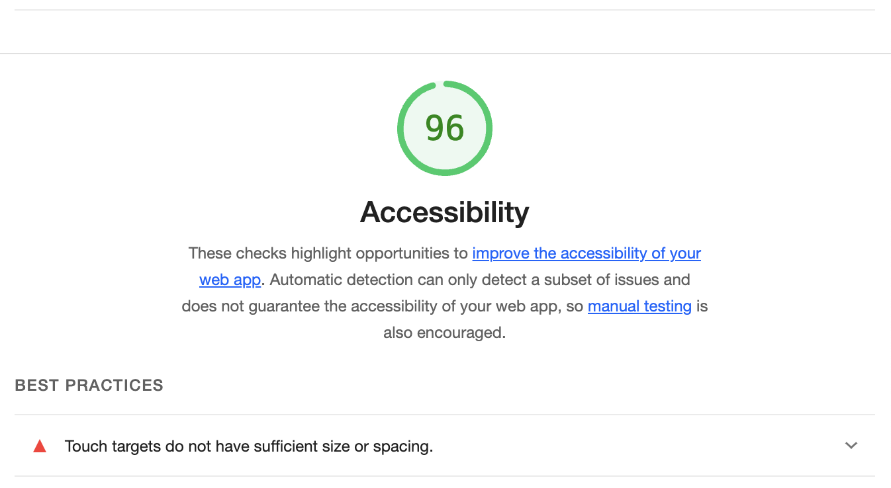
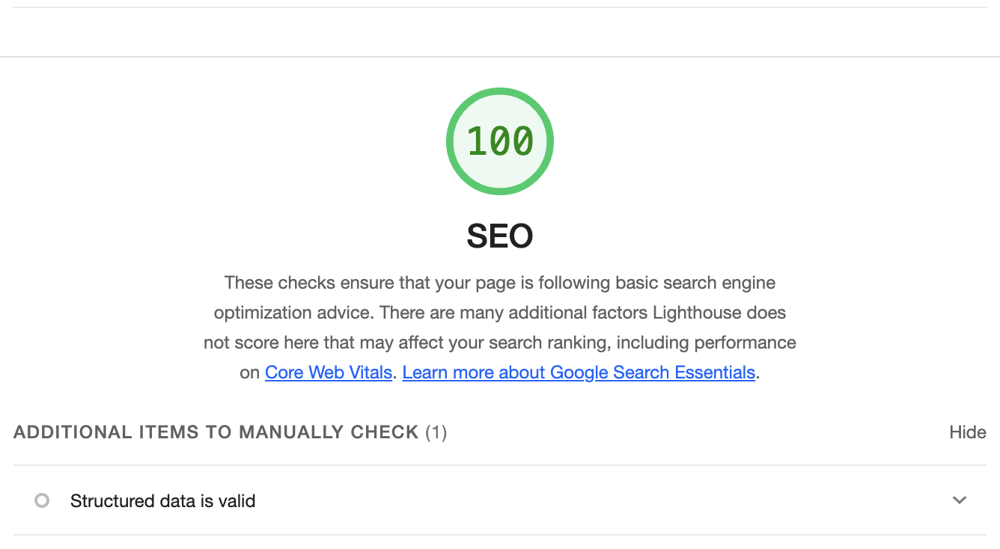

# Joan Baez - About

This project is a single-page website about Joan Baez, covering her life, discography, career highlights, activism, and legacy. The site is built using semantic HTML, is SEO-optimized, and adheres to accessibility standards.

## How to View the Project

The website is deployed on GitHub Pages and can be viewed [here](https://emilyrhyden.github.io/m3-hw3-hyden-emily).

## Lighthouse Audit Results

Below are the screenshots of the Lighthouse audit results for Accessibility and SEO:

